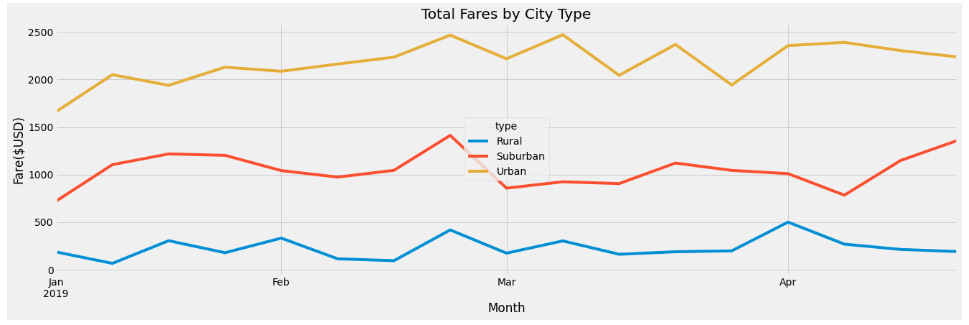

# PyBer Analysis Overview
- Omar and I have been working together on a ride-sharing analysis for our company PyBer. After the successful completion of our first presentation on this information, out CEO has asked us to dive deeper and create a summary DataFrame, multiple-line graph, and this summary report to be used for decision-making at PyBer. The decison-making process invovles improving access to ride shares in Urban, Suburban, and Rural cities. Which typ of city has the most drivers? Which type of city is raking in the highest fares? Which type of city should we try to provide more resources for? Hopefully, this analysis will help us answer those questions and strengthen our company's presence across the board. 

- Resources: 
    - Python
    - Pandas
    - Matplotlib

## Results
    - Rural cities made up less than 6% of total rides while only having 2.6% of the total drivers. However, they occupied 6.8% of the total fares. They also averaged more per driver and per ride than both suburban or urban cities.  
    - Suburban cities made up 26.3% of total rides and 30.5% of total fares with only 16.4% of total drivers!
    - Urban cities account for the majority of our current business with 68.4% of rides, 80.9% of drivers, and 62.3% of total fares. 
    - Summary DataFrame

    - Multiple-Line Graph

## Summary
    - Rural cities had a higher profit margin than their share of rides or drivers. If we hire or promote more drivers in rural cities, we stand to make bigger profits at a higher rate since the average ride fare and driver fare is already pretty high. Even if we brought those numbers down a little, we would get more riders willing to pay for those rides. There is potential for growth.
    - In a nationwide survey, 83 percent of firms said they would prefer to locate office space in walkable urban centers rather than single-use office or industrial parks.1 I would recommend that PyBer expand business in Suburban cities (and possibly even Urban cities) by adding a PyBer Eats sector to their business. With many college educated millenials electing to live in 'urbanized' suburban cities, they may opt to walk, bike, or use public transit.
    - Urban cities account for the largest part of our business, but have an excess amount of drivers in comparison to the actual revenue and rides they bring in. Thee supply is seemingly higher than the demand making it a good opportunity for us to increase rates and add a PyBer Eats sector.

### Resources
1. [Steuteville, Robert "‘Urbanizing the suburbs’ goes big" *Public Square: A CNU Journal* Accessed: March 28th, 2021](https://www.cnu.org/publicsquare/2018/03/20/%E2%80%98urbanizing-suburbs%E2%80%99-goes-big)